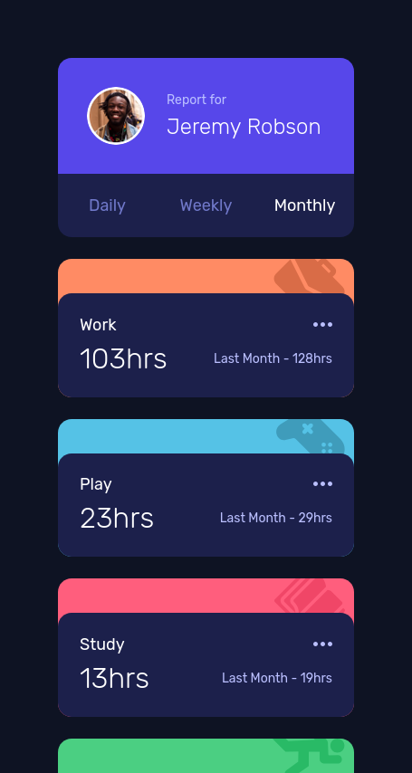
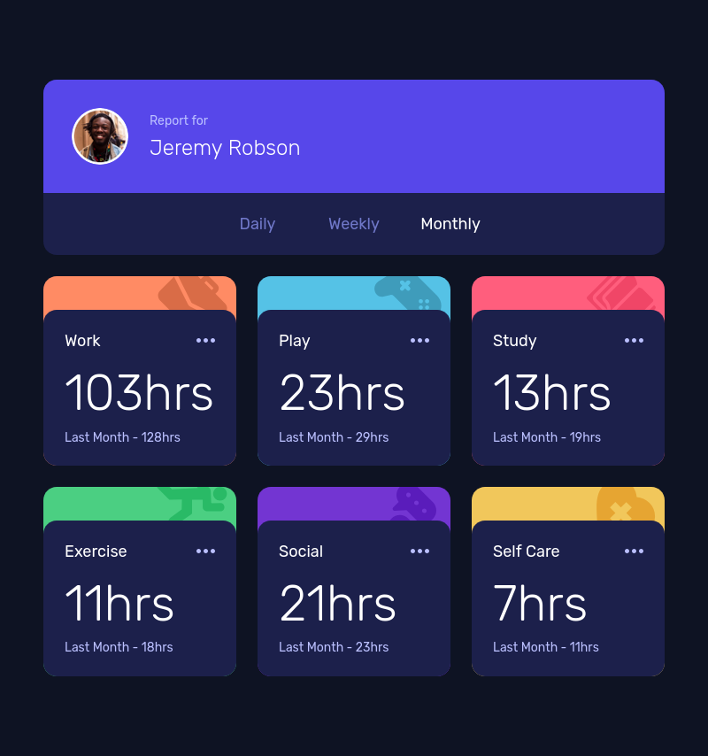
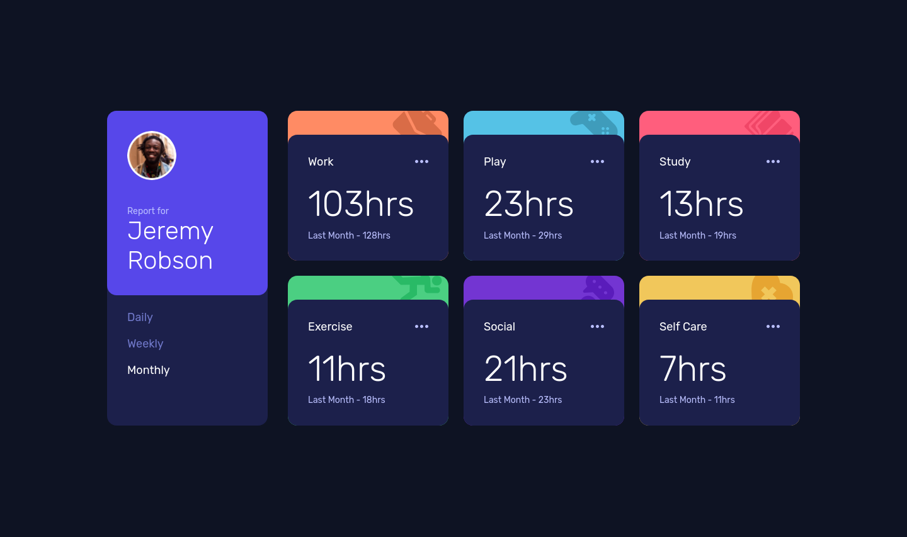

# Article preview component challenge solution

This is a solution to the [Time tracking dashboard challenge on Frontend Mentor](https://www.frontendmentor.io/challenges/time-tracking-dashboard-UIQ7167Jw).

## Table of contents

- [Overview](#overview)
    - [The challenge](#the-challenge)
    - [Screenshot](#screenshot)
    - [Links](#links)
- [My process](#my-process)
    - [Built with](#built-with)
    - [What I learned](#what-i-learned)
- [Author](#author)

## Overview

### The challenge

Users should be able to:

- View the optimal layout for the site depending on their device's screen size
- See hover states for all interactive elements on the page
- Switch between viewing Daily, Weekly, and Monthly stats

### Screenshot
|             **Mobile**              |             **Tablet**              |
|:-----------------------------------:|:-----------------------------------:|
|  |  |

|              **Desktop**              |
|:-------------------------------------:|
|  |

### Links

- Solution URL: [Add solution URL here](https://your-solution-url.com)
- Live Site URL: [GitHub Pages](https://your-live-site-url.com)

## My process

### Built with

- Semantic HTML5 markup
- [Tailwind](https://tailwindcss.com/) for styles
- Plain JS
- Flexbox
- Mobile-first workflow

### What I learned

I improved my skills in vanilla JavaScript and working with data

## Author

- Website - [lowkkid.dev](https://lowkkid.dev)
- Frontend Mentor - [@lowkkid](https://www.frontendmentor.io/profile/lowkkid)

